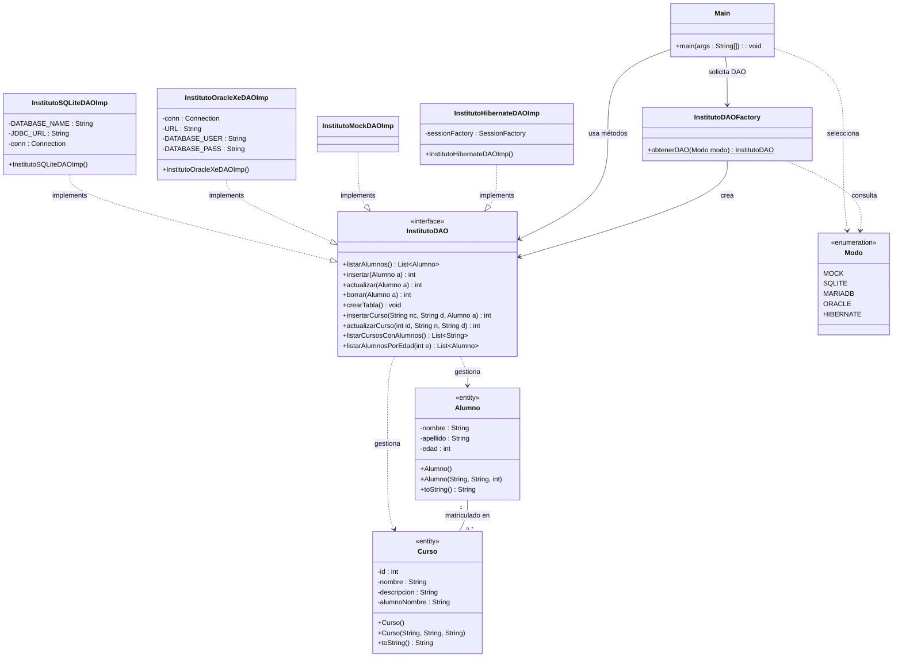

## Diagrama UML del Proyecto

```mermaid
classDiagram
    class Main {
        +main(args : String[]) : void
    }

    class InstitutoDAO {
        <<interface>>
        +listarAlumnos() List~Alumno~
        +insertar(Alumno a) int
        +actualizar(Alumno a) int
        +borrar(Alumno a) int
        +crearTabla() void
        +insertarCurso(String nc, String d, Alumno a) int
        +actualizarCurso(int id, String n, String d) int
        +listarCursosConAlumnos() List~String~
        +listarAlumnosPorEdad(int e) List~Alumno~
    }

    class Modo {
        <<enumeration>>
        MOCK
        SQLITE
        MARIADB
        ORACLE
        HIBERNATE
    }

    class InstitutoDAOFactory {
        +obtenerDAO(Modo modo)$ InstitutoDAO
    }

    class InstitutoSQLiteDAOImp {
        -DATABASE_NAME : String
        -JDBC_URL : String
        -conn : Connection
        +InstitutoSQLiteDAOImp()
    }

    class InstitutoOracleXeDAOImp {
        -conn : Connection
        -URL : String
        -DATABASE_USER : String
        -DATABASE_PASS : String
        +InstitutoOracleXeDAOImp()
    }

    class InstitutoHibernateDAOImp {
        -sessionFactory : SessionFactory
        +InstitutoHibernateDAOImp()
    }

    class InstitutoMockDAOImp {
    }

    class Alumno {
        <<entity>>
        -nombre : String
        -apellido : String
        -edad : int
        +Alumno()
        +Alumno(String, String, int)
        +toString() String
    }

    class Curso {
        <<entity>>
        -id : int
        -nombre : String
        -descripcion : String
        -alumnoNombre : String
        +Curso()
        +Curso(String, String, String)
        +toString() String
    }

    %% Relaciones de Implementación
    InstitutoSQLiteDAOImp ..|> InstitutoDAO : implements
    InstitutoOracleXeDAOImp ..|> InstitutoDAO : implements
    InstitutoMockDAOImp ..|> InstitutoDAO : implements
    InstitutoHibernateDAOImp ..|> InstitutoDAO : implements

    %% Relaciones de Dependencia y Asociación
    Main --> InstitutoDAOFactory : solicita DAO
    Main --> InstitutoDAO : usa métodos
    Main ..> Modo : selecciona
    
    InstitutoDAOFactory ..> Modo : consulta
    InstitutoDAOFactory --> InstitutoDAO : crea

    InstitutoDAO ..> Alumno : gestiona
    InstitutoDAO ..> Curso : gestiona

    Alumno "1" -- "0..*" Curso : matriculado en
```
