# Documentación Técnica Hibernate ORM

- Autor: Anas Oulghazi
- Acceso a Datos 2 DAM
- Conexiones: Hibernate, Oracle, SQLite
- https://github.com/anasoulgha/acceso2

## Índice
- [Documentación Técnica Hibernate ORM](#documentación-técnica-hibernate-orm)
  - [Índice](#índice)
  - [1 Hibernate](#1-hibernate)
    - [1.1 ¿Que es Hibernate?](#11-que-es-hibernate)
    - [2 Hibernate en la actualidad](#2-hibernate-en-la-actualidad)
      - [2.1 ¿Por qué es esto bueno en un proyecto real?](#21-por-qué-es-esto-bueno-en-un-proyecto-real)
      - [2.2 Ventajas competitivas clave](#22-ventajas-competitivas-clave)
  - [3 Implementación en el proyecto](#3-implementación-en-el-proyecto)
    - [3.1 Diagrama UML del Proyecto](#31-diagrama-uml-del-proyecto)
    - [3.2 Archivo de configuracion](#32-archivo-de-configuracion)
    - [3.3 Conexión a la base de datos](#33-conexión-a-la-base-de-datos)
    - [3.4 Mapeo de entidades](#34-mapeo-de-entidades)
    - [3.5 Busquedas y consultas](#35-busquedas-y-consultas)
    - [3.6 Inserción de datos](#36-inserción-de-datos)
    - [3.7 Modificación de datos](#37-modificación-de-datos)
    - [3.8 Borrado de datos](#38-borrado-de-datos)
    - [3.9 Creación de tablas](#39-creación-de-tablas)
  - [4 Código de Implementación Hibernate](#4-código-de-implementación-hibernate)
  - [5 Ejemplo de uso](#5-ejemplo-de-uso)


## 1 Hibernate

### 1.1 ¿Que es Hibernate?

Hibernate es una herramienta de Mapeo Objeto-Relacional (ORM) de código abierto para Java. Su función principal es actuar como una capa intermedia entre la lógica de la aplicación (objetos) y el motor de la base de datos (tablas).

Normalmente, el desarrollador debía encargarse de gestionar conexiones, preparar sentencias SQL, recorrer ResultSets y convertir cada columna en un atributo de una clase Java. Este proceso era repetitivo, propenso a errores y muy dependiente del motor de base de datos utilizado. Hibernate elimina gran parte de esta complejidad gracias a su motor interno, que genera dinámicamente las sentencias SQL necesarias y mantiene sincronizados los objetos en memoria con los datos almacenados en la base de datos.

Además, Hibernate gestiona automáticamente aspectos como las transacciones, el ciclo de vida de los objetos y la conversión entre tipos Java y tipos SQL. También permite cambiar de un motor de base de datos a otro simplemente modificando la configuración, sin necesidad de alterar el código de la aplicación. Todo esto convierte a Hibernate en una herramienta muy utilizada en proyectos modernos, ya que reduce el código necesario, mejora la mantenibilidad y ofrece una forma más intuitiva y orientada a objetos de trabajar con bases de datos relacionales.

### 2 Hibernate en la actualidad

En el desarrollo de software moderno, Hibernate ha dejado de ser una opción para convertirse en un requisito fundamental. Su integración como implementación principal de Jakarta Persistence (JPA) permite que los desarrolladores se abstraigan de las particularidades de cada motor de base de datos.


Una de las características más potentes de Hibernate es el uso de Dialectos. Un dialecto es una clase que le dice a Hibernate cómo "hablar" el lenguaje específico de una base de datos concreta (Oracle, MySQL, PostgreSQL, etc.).

#### 2.1 ¿Por qué es esto bueno en un proyecto real?

- Portabilidad: Puedes desarrollar el proyecto en local usando SQLite (por ligereza), probarlo en un entorno de integración con MariaDB y desplegarlo en producción sobre Oracle XE sin tocar una sola línea de código Java.

- Optimización específica: Hibernate sabe que Oracle usa sequences para los IDs, mientras que MySQL usa auto_increment. Al configurar el dialecto, el framework elige la sintaxis más eficiente para cada caso.

- Estandarización del lenguaje: Escribes tus consultas en Hibernate Query Language (HQL), que es agnóstico a la base de datos, y Hibernate las traduce al SQL específico de tu motor en tiempo de ejecución.

#### 2.2 Ventajas competitivas clave

- Reducción del Tiempo: Al automatizar el mapeo de datos, el equipo se centra en la lógica de negocio, acelerando el lanzamiento.

- Prevención de Errores: Evita errores comunes de sintaxis SQL manual y errores de tipo al convertir datos de la base de datos a objetos Java.

- Gestión de Transacciones: Hibernate simplifica el manejo de transacciones complejas, asegurando la integridad de los datos (ACID) con muy poco esfuerzo.

- Caché de Primer Nivel: Mejora el rendimiento de forma nativa al evitar consultas redundantes a la base de datos dentro de una misma sesión.

- Comunidad y Soporte: Al ser el estándar, cualquier problema tiene solución documentada y es compatible con prácticamente todas las herramientas de monitorización y desarrollo del mercado.

## 3 Implementación en el proyecto
En este proyecto, Hibernate se ha utilizado como una de las posibles capas de acceso a datos, seleccionable mediante el modo HIBERNATE dentro del menú principal. Su implementación se basa en tres elementos fundamentales:

- Archivo de configuración ```hibernate.cfg.xml```

- Clases entidad ```Alumno``` y ```Curso```

- DAO Hibernate ```InstitutoHibernateDAOImp```

### 3.1 Diagrama UML del Proyecto


### 3.2 Archivo de configuracion

```hibernate.cfg.xml```

```<?xml version="1.0" encoding="UTF-8"?>
<!DOCTYPE hibernate-configuration PUBLIC
        "-//Hibernate/Hibernate Configuration DTD 3.0//EN"
        "http://www.hibernate.org/dtd/hibernate-configuration-3.0.dtd">

<hibernate-configuration>
    <session-factory>
        <property name="hibernate.connection.driver_class">oracle.jdbc.OracleDriver</property>
        <property name="hibernate.connection.url">jdbc:oracle:thin:@localhost:1521/XEPDB1</property>
        <property name="hibernate.connection.username">usuario</property>
        <property name="hibernate.connection.password">usuario</property>

        <property name="hibernate.dialect">org.hibernate.dialect.OracleDialect</property>

        <property name="hibernate.show_sql">true</property>
        <property name="hibernate.format_sql">true</property>

        <property name="hibernate.hbm2ddl.auto">update</property>

        <mapping class="es.etg.dam.acceso.Alumno"/>
        <mapping class="es.etg.dam.acceso.Curso"/>

    </session-factory>
</hibernate-configuration>
```

### 3.3 Conexión a la base de datos

La conexión se configura en el archivo:

```resources/es/etg/dam/acceso/hibernate.cfg.xml```


Este archivo contiene a que base de datos nos conectamos:

```
<property name="hibernate.connection.driver_class">oracle.jdbc.OracleDriver</property>
<property name="hibernate.connection.url">jdbc:oracle:thin:@localhost:1521/XEPDB1</property>
<property name="hibernate.connection.username">usuario</property>
<property name="hibernate.connection.password">usuario</property>

```

Además, se especifica:

- El idioma de Oracle

- Mostrar SQL por consola

- Formatear SQL

- Crear/actualizar tablas automáticamente con:

```<property name="hibernate.hbm2ddl.auto">update</property>```

- Se mapean las entidades:

```
<mapping class="es.etg.dam.acceso.Alumno"/>
<mapping class="es.etg.dam.acceso.Curso"/>

```

Creacion del ```SessionFactory```

Este objeto es el encargado de abrir sesiones y gestionar la conexión.

En el constructor del DAO:
```
sessionFactory = new Configuration()
    .configure("es/etg/dam/acceso/hibernate.cfg.xml")
    .buildSessionFactory();

```

### 3.4 Mapeo de entidades

*Entidad Alumno*
```
@Entity
@Table(name = "ALUMNO")
public class Alumno {
    @Id
    @Column(name = "NOMBRE")
    private String nombre;

    @Column(name = "APELLIDO")
    private String apellido;

    @Column(name = "EDAD")
    private int edad;
}


```

*Entidad Curso*
```
@Entity
@Table(name = "CURSO")
public class Curso {
    @Id
    @GeneratedValue(strategy = GenerationType.IDENTITY)
    private int id;

    @Column(name = "ALUMNO_NOMBRE")
    private String alumnoNombre;
}
```
Hibernate usa estas anotaciones para generar las tablas automáticamente con:

```<property name="hibernate.hbm2ddl.auto">update</property>```

### 3.5 Busquedas y consultas

*Listar todos los alumnos*

```return session.createQuery("from Alumno", Alumno.class).list();```

*Listar alumnos por edad*

``` 
return session.createQuery("from Alumno where edad >= :edad", Alumno.class)
    .setParameter("edad", edadMin)
    .list();

```

*Listar cursos con alumnos*
```List<Curso> listaCursos = session.createQuery("from Curso", Curso.class).list();```

### 3.6 Inserción de datos

*Insertar alumno*

```session.persist(a);```

Hibernate genera automáticamente el INSERT

*Insertar curso*
``` 
Curso nuevoCurso = new Curso();
nuevoCurso.setNombre(nombreCurso);
nuevoCurso.setDescripcion(descripcion);
nuevoCurso.setAlumnoNombre(alumno.getNombre());
session.persist(nuevoCurso);

```
Todas las inserciones se realizan dentro de una transacción:
```
Transaction tx = session.beginTransaction();
tx.commit();

```
### 3.7 Modificación de datos

*Actualizar alumno*

```session.merge(a);```

*Actualizar curso*

```
Curso curso = session.get(Curso.class, idCurso);
curso.setNombre(nuevoNombre);
curso.setDescripcion(nuevaDesc);
```

### 3.8 Borrado de datos

```session.remove(a);````

### 3.9 Creación de tablas

```
<property name="hibernate.hbm2ddl.auto">update</property>

```
Esto hace que Hibernate:

- Cree las tablas si no existen

- Las actualice si cambian las entidades

## 4 Código de Implementación Hibernate

Aquí dejo todo el código de ```InstitutoHibernateDAOImp.java``` por si se quiere profundizar en los métodos utilizados aunque el programa entero esta completamente subido también

```
package es.etg.dam.acceso;

import java.util.ArrayList;
import java.util.List;

import org.hibernate.Session;
import org.hibernate.SessionFactory;
import org.hibernate.Transaction;
import org.hibernate.cfg.Configuration;

public class InstitutoHibernateDAOImp implements InstitutoDAO {

    private final SessionFactory sessionFactory;

    public InstitutoHibernateDAOImp() {

        sessionFactory = new Configuration().configure("es/etg/dam/acceso/hibernate.cfg.xml").buildSessionFactory();
    }

    @Override
    public List<Alumno> listarAlumnos() {
        try (Session session = sessionFactory.openSession()) {

            return session.createQuery("from Alumno", Alumno.class).list();
        }
    }

    @Override
    public int insertar(Alumno a) {
        Transaction tx = null;
        try (Session session = sessionFactory.openSession()) {
            tx = session.beginTransaction();
            session.persist(a);
            tx.commit();
            return 1;
        } catch (Exception e) {
            if (tx != null) {
                tx.rollback();
            }
            return 0;
        }
    }

    @Override
    public int actualizar(Alumno a) {
        Transaction tx = null;
        try (Session session = sessionFactory.openSession()) {
            tx = session.beginTransaction();
            session.merge(a);
            tx.commit();
            return 1;
        } catch (Exception e) {
            if (tx != null) {
                tx.rollback();
            }
            return 0;
        }
    }

    @Override
    public int borrar(Alumno a) {
        Transaction tx = null;
        try (Session session = sessionFactory.openSession()) {
            tx = session.beginTransaction();
            session.remove(a);
            tx.commit();
            return 1;
        } catch (Exception e) {
            if (tx != null) {
                tx.rollback();
            }
            return 0;
        }
    }

    @Override
    public List<Alumno> listarAlumnosPorEdad(int edadMin) {
        try (Session session = sessionFactory.openSession()) {
            return session.createQuery("from Alumno where edad >= :edad", Alumno.class)
                    .setParameter("edad", edadMin)
                    .list();
        }
    }

    @Override
    public void crearTabla() {
    }

    @Override
    public int insertarCurso(String nombreCurso, String descripcion, Alumno alumno) {
        Transaction tx = null;
        try (Session session = sessionFactory.openSession()) {
            tx = session.beginTransaction();

            Curso nuevoCurso = new Curso();
            nuevoCurso.setNombre(nombreCurso);
            nuevoCurso.setDescripcion(descripcion);
            nuevoCurso.setAlumnoNombre(alumno.getNombre());

            session.persist(nuevoCurso);

            tx.commit();
            return 1;
        } catch (Exception e) {
            if (tx != null) {
                tx.rollback();
            }
            e.printStackTrace();
            return 0;
        }
    }

    @Override
    public int actualizarCurso(int idCurso, String nuevoNombre, String nuevaDesc) {
        Transaction tx = null;
        try (Session session = sessionFactory.openSession()) {
            tx = session.beginTransaction();

            Curso curso = session.get(Curso.class, idCurso);

            if (curso != null) {

                curso.setNombre(nuevoNombre);
                curso.setDescripcion(nuevaDesc);

                tx.commit();
                return 1;
            } else {
                System.out.println("No se encontró el curso con ID: " + idCurso);
                return 0;
            }
        } catch (Exception e) {
            if (tx != null) {
                tx.rollback();
            }
            e.printStackTrace();
            return 0;
        }
    }

    @Override
    public List<String> listarCursosConAlumnos() {
        try (Session session = sessionFactory.openSession()) {

            List<Curso> listaCursos = session.createQuery("from Curso", Curso.class).list();

            List<String> resultado = new ArrayList<>();
            for (Curso c : listaCursos) {
                resultado.add("ID: " + c.getId()
                        + " | Curso: " + c.getNombre()
                        + " | Desc: " + c.getDescripcion()
                        + " | Alumno: " + c.getAlumnoNombre());
            }
            return resultado;
        } catch (Exception e) {
            e.printStackTrace();
            return new ArrayList<>();
        }
    }
}

```

## 5 Ejemplo de uso

Aquí se mostrará con imágenes de que el programa funciona con completa normalidad

0. Activar docker

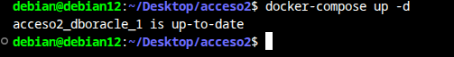

1. Conectarse con hibernate
   
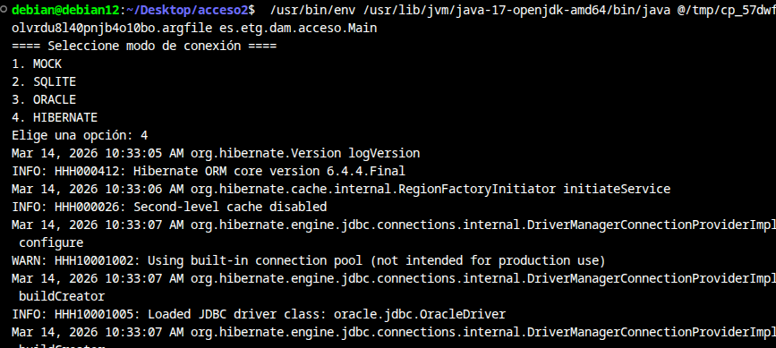

2. Insertar alumno

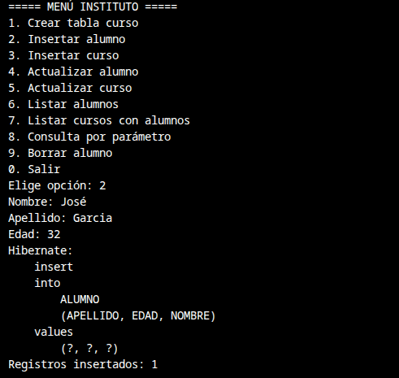

3. Insertar curso

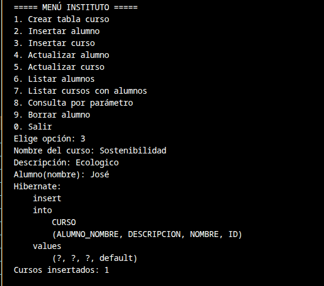

4. Actualizar alumno

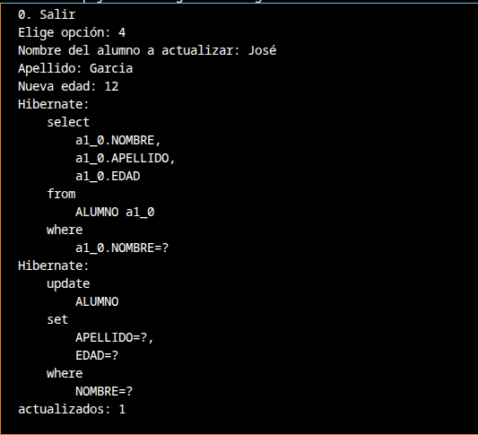

5. Actualizar curso

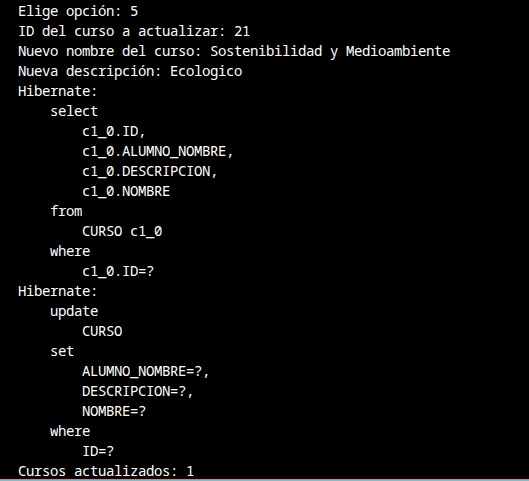

6. Listar alumnos

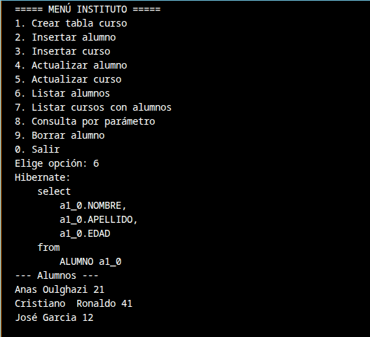

7. Listar cursos con alumnos

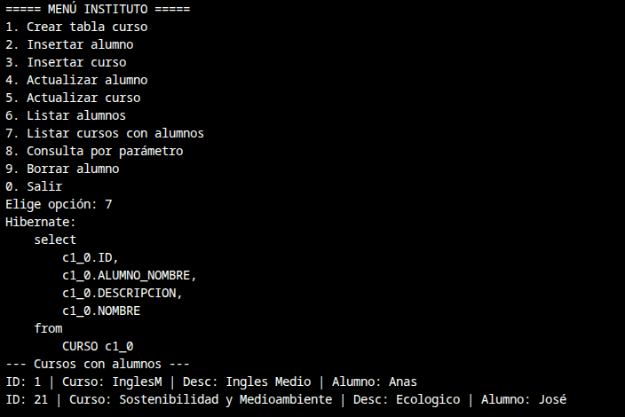

8. Consulta por parámetro

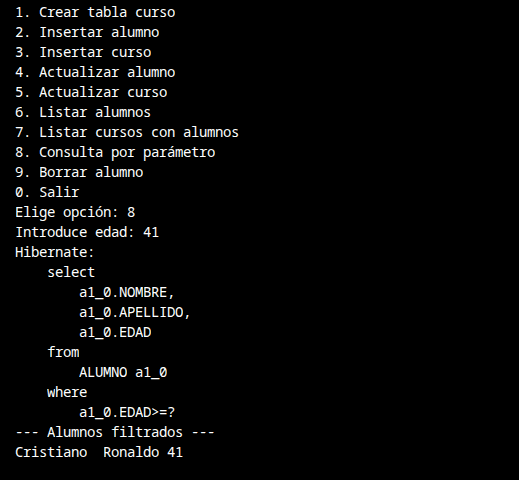

9. Borrar alumno

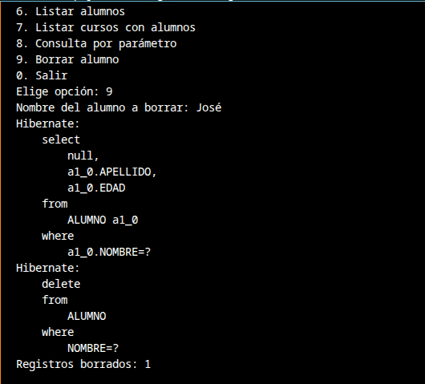
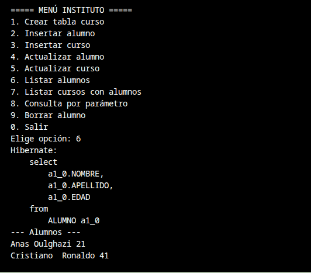